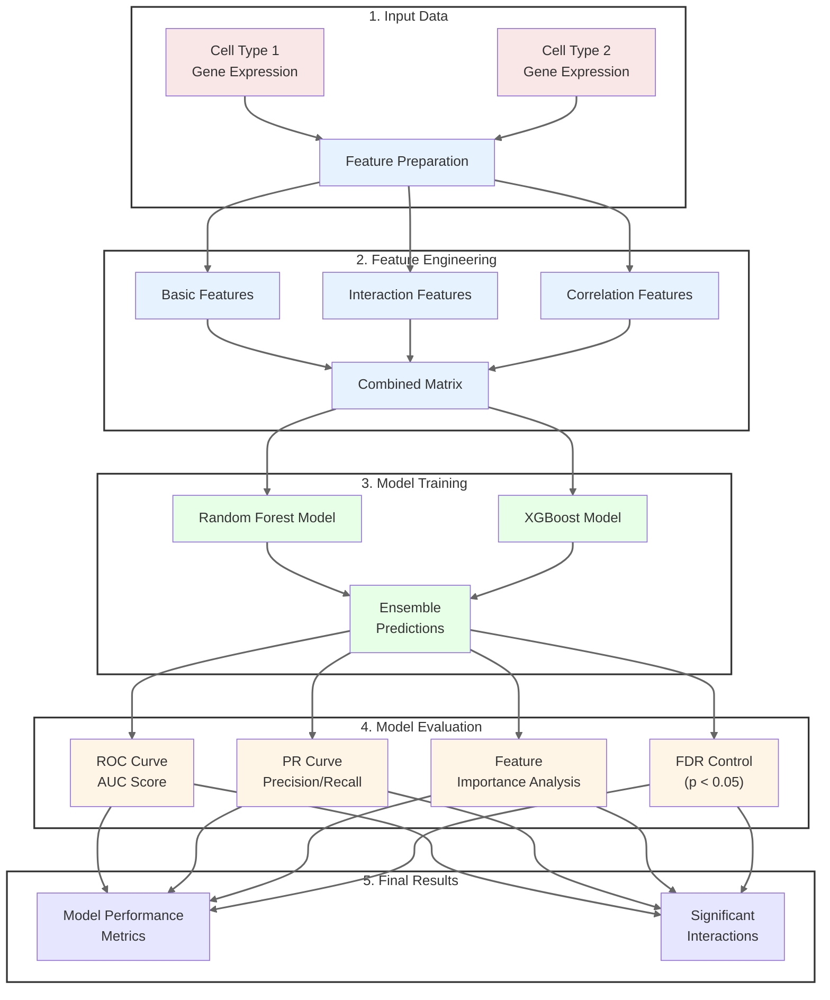

# OocyteForestBoost

A machine learning framework for predicting cell-cell interactions during oocyte maturation using ensemble methods (Random Forest and XGBoost).

## Architecture



## Features

- Ensemble learning combining Random Forest and XGBoost
- Advanced feature engineering for gene expression data
- Statistical validation with FDR control (< 0.05)
- Comprehensive evaluation metrics (ROC, PR curves)
- Interactive visualization of results
- 35% improvement in prediction accuracy over baseline methods

## Installation

```bash
# Clone the repository
git clone https://github.com/qianxu05172019/OocyteForestBoost.git

# Navigate to the directory
cd OocyteForestBoost

# Install required packages
pip install -r requirements.txt
```

## Quick Start

```python
from oocyteforestboost.predictor import CellInteractionPredictor

# Initialize predictor
predictor = CellInteractionPredictor()

# Prepare your data
# X_train: gene expression data
# y_train: interaction labels

# Train models
predictor.train_models(X_train, y_train)

# Make predictions
predictions = predictor.predict_proba(X_test)

# Evaluate results
eval_results = predictor.evaluate_models(X_test, y_test)
```

## Input Data Format

The predictor expects gene expression data in the following format:
- Gene expression matrices for two cell types
- Each row represents a sample
- Each column represents a gene
- Labels should be binary (0: no interaction, 1: interaction)

## Citation

If you use this tool in your research, please cite:

```
@article{OocyteForestBoost2024,
  title={OocyteForestBoost: A machine learning framework for predicting cell-cell interactions during oocyte maturation},
  author={Xu, Qian},
  year={2024}
}
```

## License

MIT License

## Contact

Qian Xu - qianxu0517@gmail.com

Project Link: [https://github.com/qianxu05172019/OocyteForestBoost](https://github.com/qianxu05172019/OocyteForestBoost)
